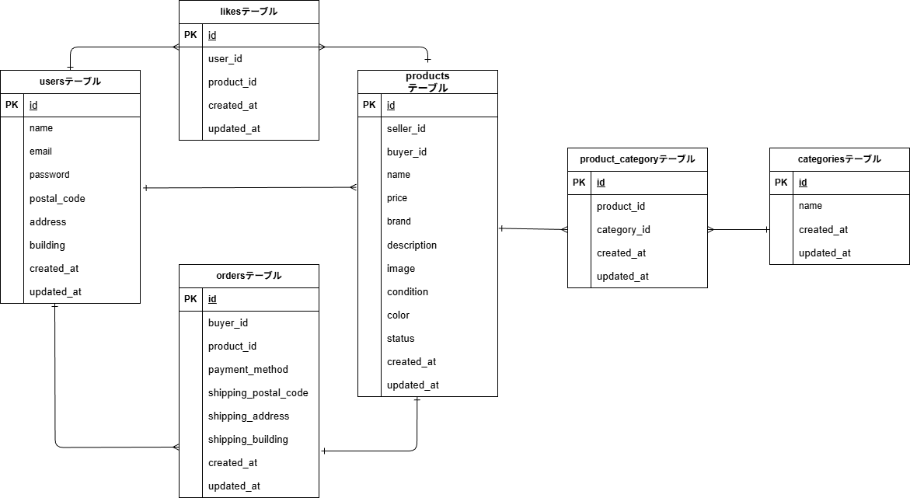

# coachtechフリマ  

## 環境構築  
**Dockerビルド**  
1. `git clone git@github.com:miho-85-ux/coachtech-fleamarket-app.git`  
2. `cd coachtech-fleamarket-app.git`  
3. DockerDesktopアプリを立ち上げる  
```bash  
'docker-compose up -d --build'  
```  

**Laravel環境構築**
1. `docker-compose exec php bash`  
2. `composer install`  
3. .env.exampleファイルから.envファイルをコピーする    
```bash  
cp .env.example .env
```   
4. envに以下の環境変数を追加  
``` text  
DB_CONNECTION=mysql 
DB_HOST=mysql 
DB_PORT=3306 
DB_DATABASE=laravel_db 
DB_USERNAME=laravel_user 
DB_PASSWORD=laravel_pass 
```  
5. アプリケーションキーの作成  
```bash  
php artisan key:generate  
```  
6. マイグレーションの実行  
```bash  
php artisan migrate  
```  
7. シーディングの実行  
```bash  
php artisan db:seed   
```  
8. シンボリックリンク作成  
``` bash  
php artisan storage:link 
```  

## 使用技術 
* PHP:8.1.33 
* Lravel:8.83.8 
* MySQL:8.0.26 
* nginx:1.21.1 

# 開発環境 
* 商品一覧:http://localhost/  
* phpmyadmin:http://localhost:8080

# ER図添付  
 [ER図]




